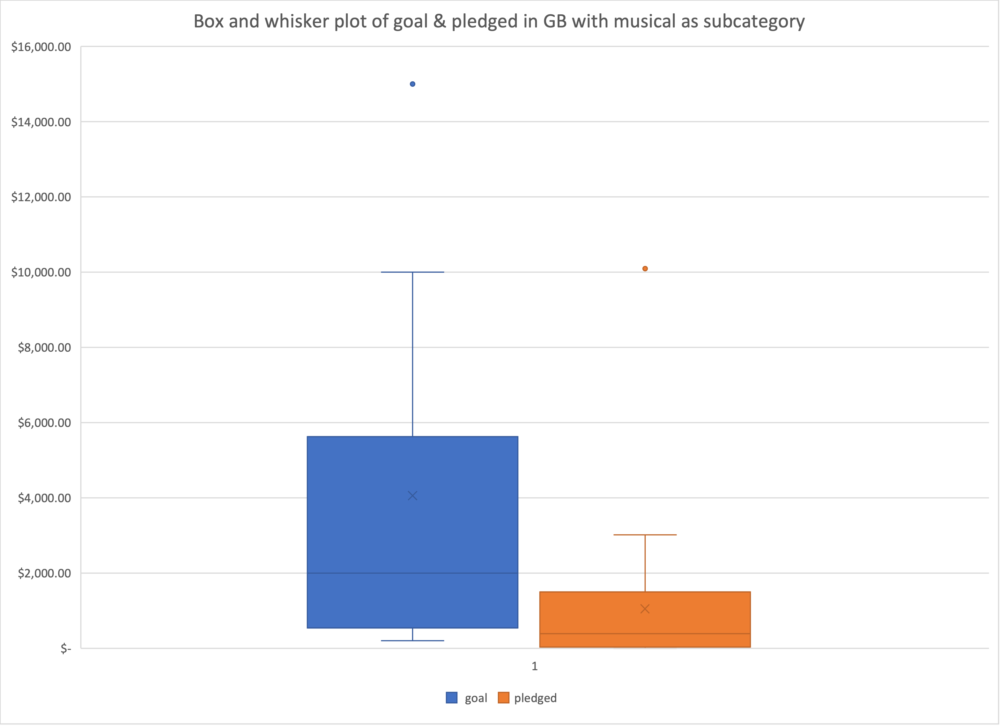

# An analysis o Kickstarter Campaigns
Performing analysis on Kickstarter data to locate insights.

Based on box and whisker plot, musical campaigns in GB, goal has a higher range, higher quartiles, higher mean, and higher medium compared to pledged. In brief, musical campaigns tend to aim for higher goals, but the actual pledges are much less. Plots indicats that there are one outlier in both goal and pledged, however this should not be taken into consideration in our analysis as it requires in-depth research on the reasonings. It would make more sense for Louise to set her campaign goal in the reasonable range between $386 and $1496. 

 ---
 
 
Line graph shows the amount of different outcomes spread out by each month. If Louise wants to start a theater campaign, according to analysis report, May has the highest success outcomes in history, and this is followed by June and July. But if we were to look into the failed numbers, it is obvious that May would be the most ideal month to start the campaign because number of failures are close in May, June and July. (Canceled cases are relatively small, thus in this analysis we will be disregarding them for easier computation)

Assume success is positive 1, while fail is negative 1. Calculation gives us the followings: 
- May: 111 - 52 = 59
- June: 100 - 49 = 51
- July: 87 - 50 = 37

